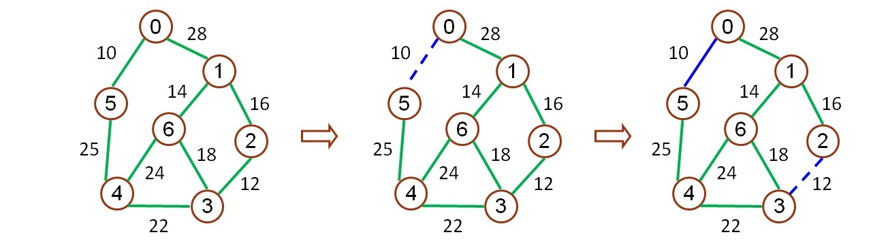
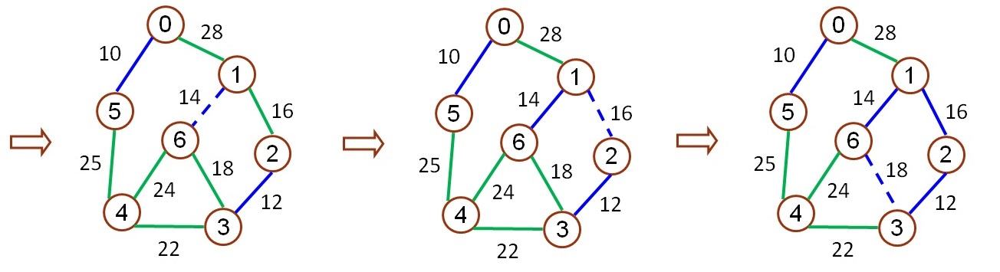
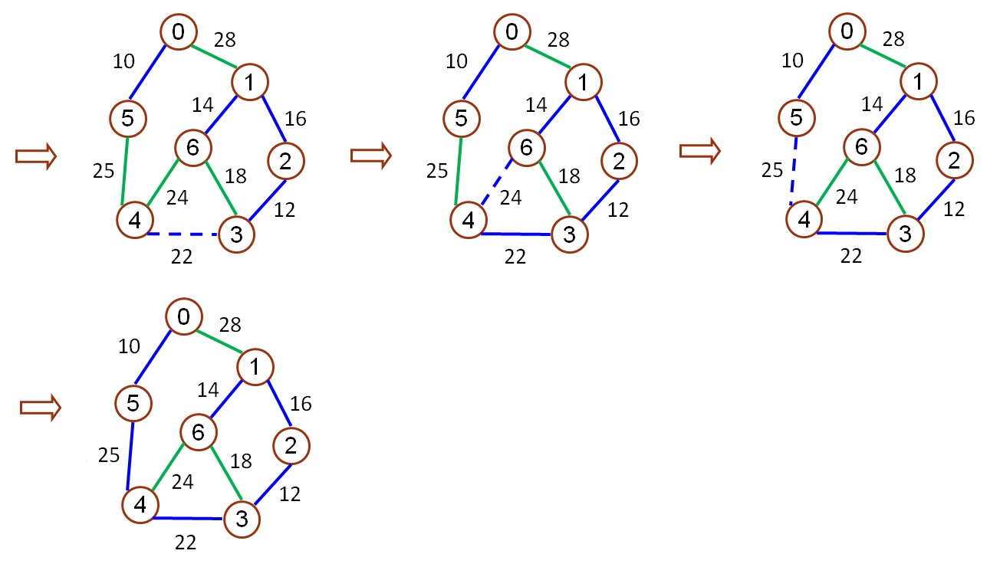

# 2_3 Kruskal’s Algorithm

輸入一圖形資料，圖形可由邊集合來描述，每對頂點代表兩頂點之間有邊相連，且每個邊都有其權重，
使用 Adjacency list 儲存圖形資料，利用 Kruskal’s Algorithm 找出 minimum spanning tree。

※ Kruskal’s Algorithm：使用 greedy method 找出 minimum spanning tree。

- 使用 greedy method 的限制：
  1. 所選擇的邊成本總和為最小成本。
  2. 只能使用圖形內的邊。
  3. 只能使用恰好 n-1 邊。
  4. 不可使用會形成迴路的邊。
- 作法：
  1. 根據各邊的成本，將所有邊由小到大排序，每個點各自為一個集合。
  2. 由最小的邊開始尋找 minimum spanning tree。
  3. 將邊由小到大開始，使用 union - find 將點加入集合，並檢查是否會形成迴路，有以下 2 種情形：
     1. 若與 minimum spanning tree 相連的點集合形成迴路，則不加入此點集合中。
     2. 若未形成迴路，則加入與此點相連之 minimum spanning tree 點集合中。
  4. 重複步驟 3 ，直到檢查完所有邊，且 minimum spanning tree 的邊個數恰好為 n-1 個。
- 使用 union - find 檢查迴路：
  1. 方法：有下列兩種情形
     1. 若加入一個邊 形成迴路，則頂點 u 和頂點 v 會在同一個點集合中，即 find( u ) = find( v )。
     2. 若加入一個邊 不會形成迴路，則執行 union( find( u ), find( v ) )。
- 範例：
  - 將邊由小到大排序 `<0,5> <2,3> <1,6> <1,2> <3,6> <3,4> <4,6> <4,5> <0,1>`





## Hint

1. 隱藏測資最多四萬筆
2. 如權重相同優先輸出序號小的數
3. 請使用 O(nlogn) 的排序演算法來排序

## Input

輸入一串數字(數字用 tab 隔開，每對數字用換行區格)，前兩個數字代表與邊相連之兩個頂點，第三個數字代表此邊之權重，且每對 <> 間有空白。

Ex:

```
0 1 28
0 5 10
1 2 16
1 6 14
2 3 12
3 4 22
3 6 18
4 5 25
4 6 24
```

## Output

輸出 Adjacency list ，數字與 `->` 間及 `->` 與 `end` 間有空白，且每個字皆與 `:` 之間有空白，再依找尋順序並標出順序，輸出所找出 minimum spanning tree 的所有邊及其最小成本。

## Sample

1.  Input

    ```
    0 1 28
    0 5 10
    1 2 16
    1 6 14
    2 3 12
    3 4 22
    3 6 18
    4 5 25
    4 6 24
    ```

    Output

    ```
    Adjacency list:
    0: 1 -> 5 -> end
    1: 0 -> 2 -> 6 -> end
    2: 1 -> 3 -> end
    3: 2 -> 4 -> 6 -> end
    4: 3 -> 5 -> 6 -> end
    5: 0 -> 4 -> end
    6: 1 -> 3 -> 4 -> end

    minimum spanning tree:
    1: <0,5>
    2: <2,3>
    3: <1,6>
    4: <1,2>
    5: <3,4>
    6: <4,5>

    The cost of minimum spanning tree: 99
    ```

2.  Input

    ```
    0 1 88
    0 2 58
    0 4 10
    1 2 82
    1 3 92
    2 4 67
    3 4 7
    ```

    Output

    ```
    Adjacency list:
    0: 1 -> 2 -> 4 -> end
    1: 0 -> 2 -> 3 -> end
    2: 0 -> 1 -> 4 -> end
    3: 1 -> 4 -> end
    4: 0 -> 2 -> 3 -> end

    minimum spanning tree:
    1: <3,4>
    2: <0,4>
    3: <0,2>
    4: <1,2>

    The cost of minimum spanning tree: 157
    ```
