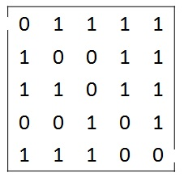
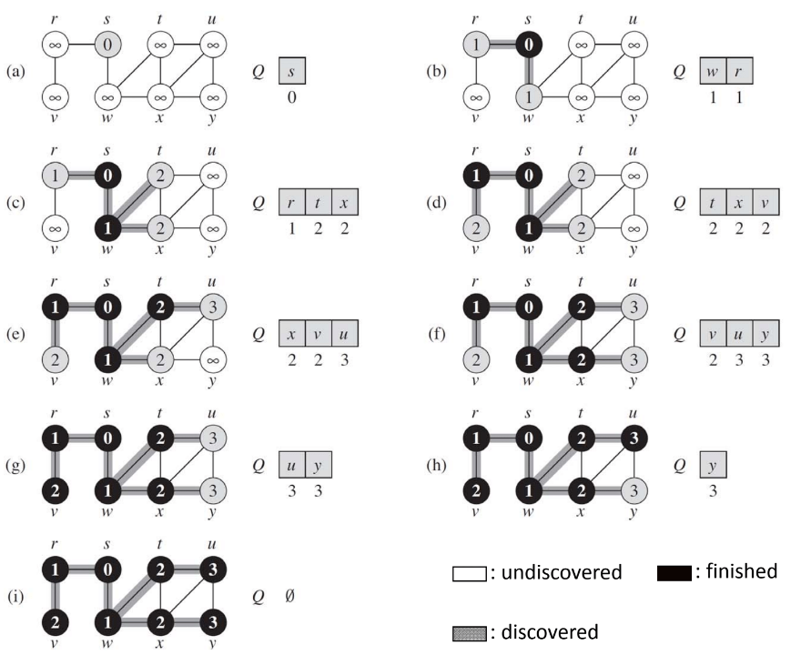

# 4_1 Maze

給定一個迷宮，並定義路口及出口，請撰寫一程式輸出從入口到出口的最短路徑。

- 迷宮的表示方法：

  下圖為一個給定的 5\*5 迷宮，且入口為 (1, 1)，出口為 (5, 5)。

  我們將以一個二維陣列 maze[row][col] 來表示此迷宮，其中，row 代表列數，col 代表行數；0 代表可通行的路徑，1 代表有障礙不可通行之路徑。

  Ex：maze[1][1] = 0，maze[1][4] = 1。
  

- 作法：

  使用 breadth-first 來搜尋路徑並以 backtracking 找到最短的路徑。
  

## Input

輸入為一個迷宮，以多列表示。

第一列有六個數字，並以 空格 隔開，內容分別為：迷宮的大小(列數 Y 與行數 X) 起點的座標(Y,X) 終點的座標(Y,X)

Ex：5 5 1 1 5 5，表示迷宮的大小為 5\*5，座標 (1,1) 為起點，(5,5) 為終點。

第二列之後即為迷宮，0 表示可通行路徑，1 表示有障礙不可通行。

## Output

依照問題描述中「作法」的敘述，找出迷宮中能夠到達終點的路徑，並將最短路徑印出

第一為 最短路徑長度

之後的每列 印出路徑中每一個走過的座標，並以換行隔開

最後一列有換行符號。

Ex：

```
最短路徑長度
(path1 座標)
(path1 座標)
...
```

提示：檢查順序為上方開始順時鐘方向

## Sample

1. Input

   ```
   5 5 1 1 5 5
   01111
   10011
   11011
   00101
   11100
   ```

   Output

   ```
   5
   (1,1)
   (2,2)
   (3,3)
   (4,4)
   (5,5)
   ```

2. Input

   ```
   7 16 1 1 7 16
   0100001000000001
   1011110111111110
   1101111101100010
   0110100000000010
   1011011011100110
   0000101111111101
   1010110000000010
   ```

   Output

   ```
   16
   (1,1)
   (2,2)
   (3,3)
   (4,4)
   (5,5)
   (6,6)
   (7,7)
   (7,8)
   (7,9)
   (7,10)
   (7,11)
   (7,12)
   (7,13)
   (7,14)
   (6,15)
   (7,16)
   ```
