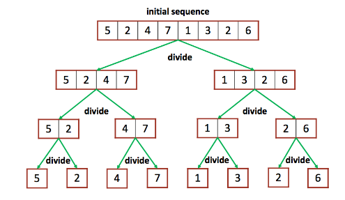
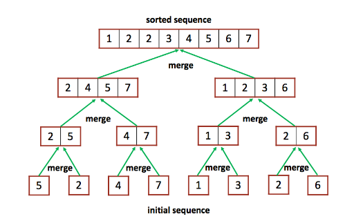
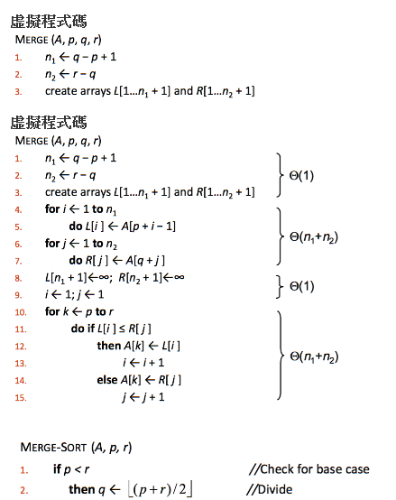

# 1_1 Merge Sort

使用 Merge Sort 進行排序

Merge Sort:





分割主陣列，產生子陣列，再從子陣列掃描最小元素，填回主陣列。

## Pseudocode



## Hint

1. 輸入最多五萬個數
2. 變數都是`int`
3. 請善用`<limits.h>`內的`INT_MAX`，來當作 ∞
4. `malloc`記得`free`
5. 用 O(n²) 的演算法會爆炸，可以用 Bubble Sort 來嘗試看看

## Input

未經排序的數字，數字間以一個空白區隔，最後會有`EOF`

## Output

輸出為使用 merge sort 排序過的序列，數字間以一個空白區隔（最後一個數字後也有空白），結尾需加上換行符號`\n`

## Sample

1.  Input
    ```
    4 8 0 3 6 2 
    ```
    Output
    ```
    0 2 3 4 6 8 
    ```
2.  Input
    ```
    0 33 11 2 9 39 36 4 2 
    ```
    Output
    ```
    0 2 2 4 9 11 33 36 39 
    ```
