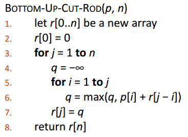

# 2_3 Rod Cutting

不同長度的竿子可賣的價格不同，假設有一條竿子，不限切成幾分，請使用動態規劃法，找出能賣的最高價格。


## Pseudocode



- 記得更新 p

## Input

第一行輸入，竿子的長度(1 至 50000)

第二行之後，輸入每種長度的賣價（如下表範例），長度、賣價以空格分開

最後一行輸入 0 0，代表輸入結束

| length i | 1   | 2   | 3   | 4   | 5   | 6   | 7   | 8   | 9   | 10  |
| -------- | --- | --- | --- | --- | --- | --- | --- | --- | --- | --- |
| price Pi | 1   | 5   | 8   | 9   | 10  | 17  | 17  | 20  | 24  | 30  |

Ex:

```
4
1 1
2 5
…
9 24
10 30
0 0
```

## Output

可賣的最高價格，結尾需加上換行符號`\n`

## Sample

1.  Input

    ```
    4
    1 1
    2 5
    3 8
    4 9
    5 10
    6 17
    7 17
    8 20
    9 24
    10 30
    0 0
    ```

    Output

    ```
    10
    ```

2.  Input

    ```
    16
    1 1
    2 5
    3 8
    4 9
    5 10
    6 17
    7 17
    8 20
    9 24
    10 30
    11 40
    12 26
    0 0
    ```

    Output

    ```
    53
    ```
