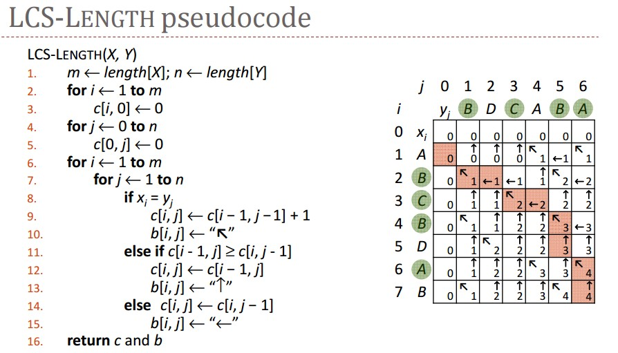
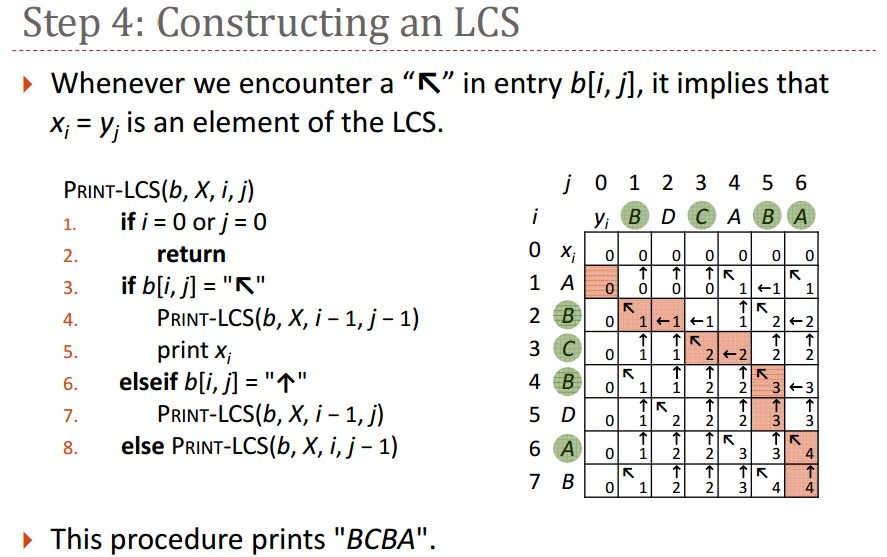

# 2_3 Longest Common Subsequence

一個子序列是原本序列的一部分，請找出兩個序列的最長共同子序列，並算出最長共同子序列的長度。

For example:

```
X = 〈A, B, C, B, D, A, B〉
Y = 〈B, D, C, A, B, A〉
〈B, C, A〉is a common subsequence of both X and Y.
〈B, C, B, A〉is an longest common subsequence (LCS) of X and Y.
長度 = 4
```

## Pseudocode




## Input

輸入兩個任意長度的字串，內容由英文大小寫字母和數字組成（長度 1 至 20000）

Ex:

```
UABCDDEA
CACCEA
```

## Output

最長共同子序列的長度，結尾需加上換行符號`\n`

## Hint

i 用 i%2 取代，i-1 用 (i+1)%2 取代

## Sample

Input

```
ABCBDAB
BDCABA
```

Output

```
4
```
