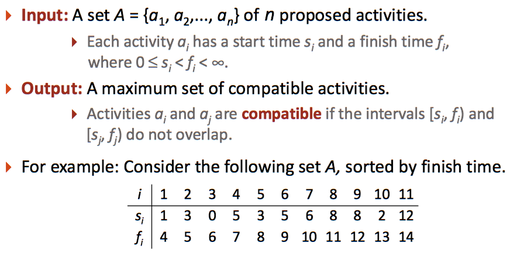
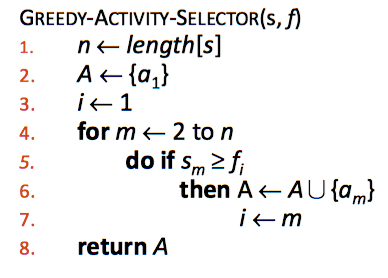

# 2_1 Greedy Activity Selector

使用貪婪演算法，參加最多的活動。




## Pseudocode



## Hint

1. 變數都是`int`
2. 隱藏測資有三萬筆輸入

## Input

序號、開始時間、結束時間，結束時間已排序

## Output

參加的活動序號 + 空白，由小到大排列，結尾有`\n`

## Sample

1.  Input
    ```
    1 2 3
    2 0 7
    3 3 8
    4 3 8
    5 6 11
    6 4 13
    7 4 13
    8 5 14
    9 10 20
    10 10 21
    ```
    Output
    ```
    1 3 9 
    ```
2.  Input
    ```
    1 0 5
    2 3 8
    3 6 8
    4 1 9
    5 9 10
    6 2 10
    7 10 11
    8 6 11
    9 0 11
    10 4 12
    11 10 13
    12 5 14
    13 7 15
    14 4 15
    15 6 15
    16 10 16
    17 11 17
    18 7 17
    19 9 18
    20 11 22
    ```
    Output
    ```
    1 3 5 7 17 
    ```
