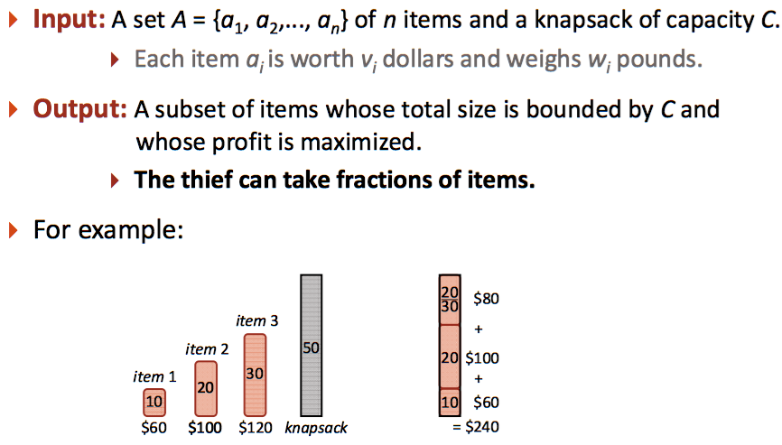

# 2_2 Fractional Knapsack Problem

使用貪婪演算法，拿取價值總和最高的物品（可以分割物品）。



## Pseudocode


## Hint

1. 請先依據(價值/重量)排序物品
2. 隱藏測資最多四萬筆
3. 浮點數計算請使用`double`型態
4. 請使用 O(nlgn) 的排序演算法 `qsort<stdlib.h>`
5. 使用%lf,來做輸出

## Input

第一行為背包容量，之後每行都是物品價值、重量

## Output

可賣出的最高價錢，輸出小數點六位數，結尾有換行符號

## Sample

1.  Input
    ```
    18
    45 7
    40 6
    51 85
    57 10
    17 43
    35 84
    ```
    Output
    ```
    113.500000
    ```
2.  Input
    ```
    75
    33 38
    80 87
    3 38
    77 29
    52 51
    82 7
    51 43
    27 34
    39 89
    32 13
    44 66
    ```
    Output
    ```
    221.837209
    ```
