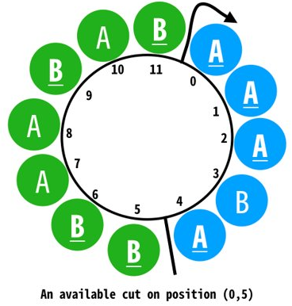

# ABCircle

[高中生程式解題系統 ZeroJudge d017](https://zerojudge.tw/ShowProblem?problemid=d017)

這裡有一個 A,B 構成的圓，我們稱它為 AB Circle

你可以看到圖中從圓中找出兩個端點切開，我們可以得到兩個字串，仔細觀察，聰明的你應該發現了，其中一個字串中 A 的數量等於另一個字串中 B 的數量。

找出一個這樣的切法很簡單，可是每個圓的切法可能不只一種，而你現在的工作就是要找出一個圓中所有的切法。



## Input

輸入可能有很多筆，每一筆的字串長度介於 2 到 200 之間。字串只會有 `a` 跟 `b`，而且每個字串必有至少一個 `a` 跟 `b`。

## Output

針對每一筆測資，請先輸出 `AB Circle #n:`，n 表示第幾筆輸入。接著將符合條件的切法的兩個端點輸出，兩個端點之間以逗點隔開。

如果一個字串有超過一種可行的切割法，則輸出時必須由小至大排序輸出。

對於長度為 n 的輸入，輸出的答案應該介在 0 到 n-1 之間。

每一筆測資結束之後請再輸出一列空白列。

## Sample

Input

```
ab
baa
```

Output

```
AB Circle #1:
0,1

AB Circle #2:
0,1
0,2
1,2

```
