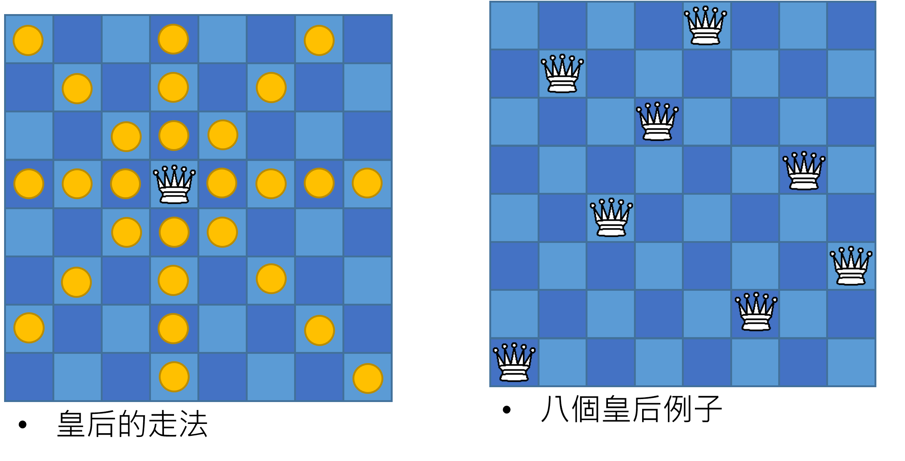
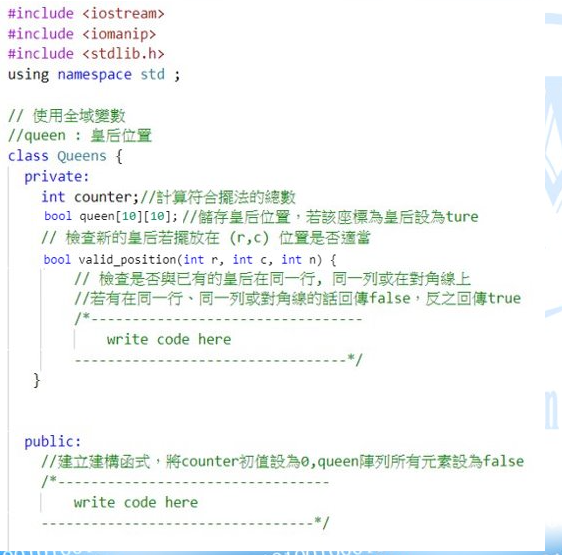
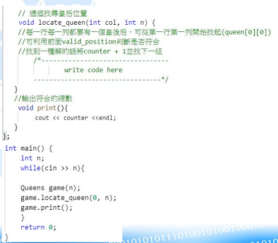

# N-Queens

[LeetCode 51](https://leetcode.com/problems/n-queens)

如何能在 N×N 的西洋棋棋盤裡放上 N 個皇后，使得任一皇后都無法直接吃掉其他的皇后?

試著找出所有擺法，旋轉或對稱視為不同解

下圖為 N=8 的其中一個擺法, 且 N=8 共有 92 種擺法


設 N 的範圍為 1~10

## Example Code




## Input

- N 為 1~10 的任意數字
- N \* N 為棋盤大小
- N 為皇后的數量

## Output

輸出所有正確的皇后的擺法總數

## Sample

Input

```
8
1
```

Output

```
92
1

```
