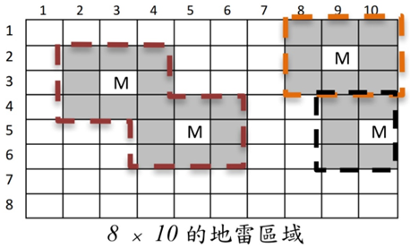

# 引爆地雷

國家防衛隊的防衛系統發現，敵國一夕之間在兩國交界區域佈下許多地雷，這種地雷的特性是周圍均有感測裝置，只要觸發感測裝置就會引發地雷爆炸，而如果感測裝置上也有其他地雷的感測裝置，就會引發連鎖感應而產生連環爆炸。

國家防衛隊已偵測到地雷的座標位置，並準備使用誘導彈引爆所有的地雷，你的任務就是根據地雷的座標，並善加利用地雷的連鎖感應機制，讓國家防衛隊所需使用的誘導彈數量越少越好。

若以 a×b 表示地圖大小，並以座標（1, 1）表示左上角位置。右圖即為一個 8×10 的地圖，其中 M 標示地雷位置，其周圍灰色區域為感測裝置，只要誘導彈命中地雷（3, 3）或（5, 5）或其周圍任一感測裝置，就可以一次引爆這兩個地雷，但地雷（2, 9）及（5, 10）各需一顆誘導彈加以引爆，所以一共只需要發射 3 顆誘導彈就可以引爆四個地雷。

#地雷會連鎖引爆，若感測裝置感應到地雷爆炸，本身也會引爆

例如地雷位置為（1, 1）（2, 2）（3, 3）（4, 4）

則只需要引爆一次



## Input

範例 10 10 為地圖大小，2 為地雷數量

1 1

10 10

依序為 2 個地雷座標

## Output

輸出為所需要使用的誘導彈數量

## Sample

Input

```
10 10 2
1 1
10 10
```

Output

```
2
```
