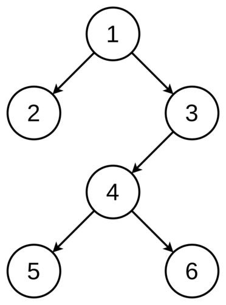

# 二元樹的陣列表示法

給定一棵二元樹(如下圖)，請撰寫一程式輸出其陣列表示法。



陣列表示法：

若一個完整二元樹有 `n` 個節點，則對於任一 index 為 `i` 的節點，`1 ≤ i ≤ n` (根節點的 index = 1)，其父節點及子節點的 index 為：

- `i` 的父節點 index = `⌊ i / 2 ⌋`
- `i` 的左子節點 index = `2 * i`
- `i` 的右子節點 index = `2 * i + 1`

因此，以上圖為例，其陣列表示法依 index 順序輸出為：`1 2 3 0 0 4 0 0 0 0 0 5 6`

## Input

第一列為一整數 `n` (1 ≤ n ≤ 10)，代表頂點個數

其後每列有三個正整數值，分別代表：有子樹的節點、其左子樹、其右子樹，(第二列的第一筆為 root )

- 掃描方式從根節點開始，由上到下、由左至右
- 若子樹不存在則以 `0` 表示，三數間以空白隔開

輸入 `-1` 結束

## Output

輸出為一列數字，表示二元樹的陣列表示法，其中 `0` 代表元素不存在，並以空白隔開。輸出到所有節點出現為止。

## Sample

Input

```
6
1 2 3
3 4 0
4 5 6
-1

```

Output

```
1 2 3 0 0 4 0 0 0 0 0 5 6
```
