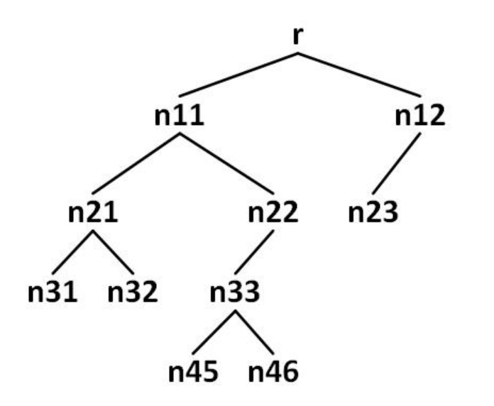

# 建立二元樹，求前序中序後序和平衡係數

二元樹中，

- 中序追蹤依照左子樹，樹根節點，右子樹之順序拜訪每一個節點
- 前序追蹤依照樹根結點，左子樹，右子樹之順序拜訪每一個節點
- 後序追蹤依照左子樹，右子樹，樹根節點之順序拜訪每一個節點
- 二元樹的平衡係數即為左右子樹樹高差

本題二元樹輸入規則為：

```
r n11 n12
n11 n21 n22
n12 n23
n21 n31 n32
n22 n33
n33 n45 n46
0
```

以範例第一行來說， root 為 `r`，`n11` 和 `n12` 為它的兒子

尾數為偶數者，為其右子樹、反之，則為左子樹

範例第三行，僅有一個兒子，輸入 `0` 為結束



請根據所建立的二元樹，輸出前序、中序、後序(節點間、最後一個節點之後加上一個空白)及平衡係數

## Input

| input       | note                                                                                      |
| ----------- | ----------------------------------------------------------------------------------------- |
| r n11 n12   | `r` 為 root，`n11` 和 `n12`為他的兒子，`n11` 尾數為奇數為左子樹，`n12` 尾數為偶數為右子樹 |
| n11 n21 n22 | `n21` 和 `n22` 為 `n11` 的兒子，`n21` 尾數為奇數為左子樹，`n22` 尾數為偶數為右子樹        |
| n12 n23     | `n23` 為 `n12` 的兒子，`n23` 尾數為奇數維左子樹                                           |
| n21 n31 n32 | `n31` 和 `n32` 為 `n21` 的兒子，`n31` 尾數為奇數為左子樹，`n32` 尾數為偶數為右子樹        |
| n22 n33     | `n33` 為 `n22` 的兒子，`n33` 尾數為奇數維左子樹                                           |
| n33 n45 n46 | `n45` 和 `n46` 為 `n33` 的兒子，`n45` 尾數為奇數為左子樹，`n46` 尾數為偶數為右子樹        |
| 0           | 結束                                                                                      |

## Output

輸出此樹的前中後序及平衡係數，請參考下面範例

## Sample

Input

```
r n11 n12
n11 n21 n22
n12 n23
n21 n31 n32
n22 n33
n33 n45 n46
0

```

Output

```
Preorder: r n11 n21 n31 n32 n22 n33 n45 n46 n12 n23
Inorder: n31 n21 n32 n11 n45 n33 n46 n22 r n23 n12
Postorder: n31 n32 n21 n45 n46 n33 n22 n11 n23 n12 r
The balance factor is 2

```
