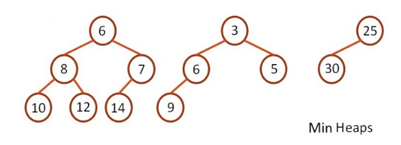
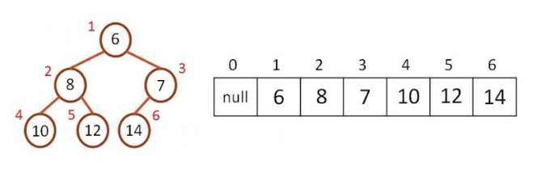
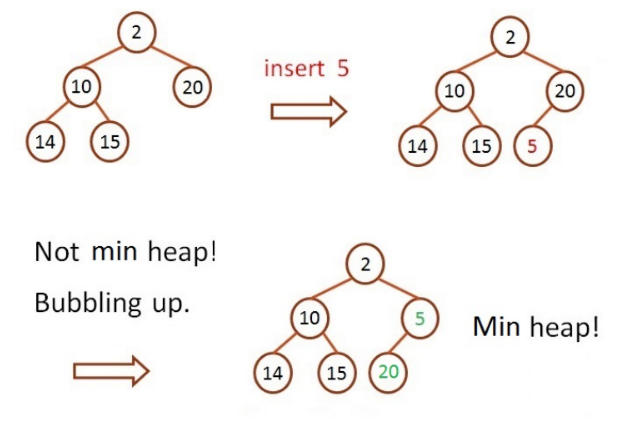
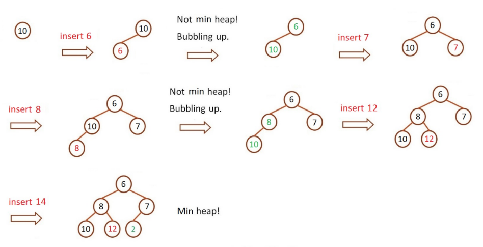
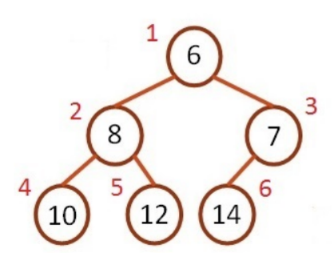

# Min Heap 插入節點

輸入為一串數字，將數字逐一插入至 Min heap 中，每插入一個數字便輸出整棵樹。

Min heap 性質

- 為一個完整二元樹
- 為一個最小樹，其所有父節點一定小於子節點
- 可以使用陣列實作 Min heap，陣列 index 0 不放節點





插入節點

- 仍須維持 Min heap 的性質
- 步驟:
  1. 插入一個新的節點在樹的最後端，並符合完整二元樹的性質
  2. 使用 bubbling up（冒泡）來滿足 Min heap 的特性
  3. 若父節點比新增加的節點大，則交換位置
  4. 重覆以上步驟，直到所有父節點皆小於子節點



範例:


## Input

輸入一串數字,每個數字用空白隔開

## Output

每輸入一個節點，就印出整棵樹

表示方法為: `[index]元素值`，每個元素間以空白隔開，每行的最後有空白

Ex: `[1]6 [2]8 [3]7 [4]10 [5]12 [6]14`



## Sample

Input

```
10 6 7 8 12 14

```

Output

```
[1]10
[1]6 [2]10
[1]6 [2]10 [3]7
[1]6 [2]8 [3]7 [4]10
[1]6 [2]8 [3]7 [4]10 [5]12
[1]6 [2]8 [3]7 [4]10 [5]12 [6]14

```
