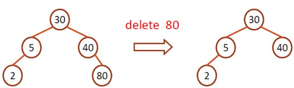
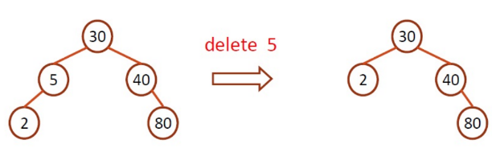
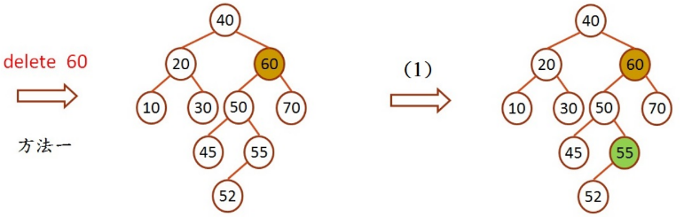
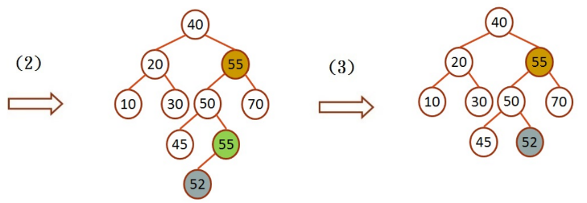
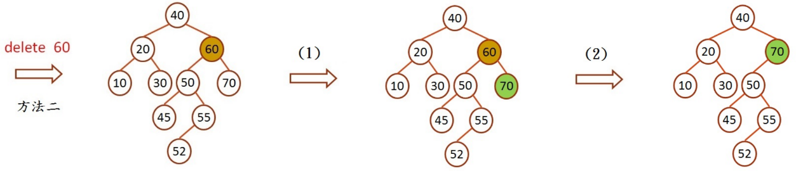

# 二元搜尋樹刪除節點

讀入一串未排序數字，建出二元搜尋樹，在讀入一串指定數字，在二元搜尋樹中尋找與此數字相等之節點 key 值，有則刪除，無則輸出錯誤訊息，在刪除完所有指定節點後，用 Pre-order Traversal 印出刪除此節點後的二元搜尋樹。

二元搜尋樹刪除節點：在二元搜尋樹找尋欲刪除之節點，有下列三種不同的情況需要處理。

1. 無子節點，則刪除節點，並將其父節點的指標設為 NULL

   

2. 有一個子節點，則刪除節點，並將其父節點的指標指向子節點

   

3. 有兩個子節點

   - 方法一：將被刪除的節點之左子樹中最大 key 值之節點來取代它的位置

     1. 找到左子樹中最大 key 值之節點 55
     2. 複製 55 取代 被刪去的 60
     3. 再將原來的 55 刪去，因為左子樹中的最大節點，最多只會有一個子節點，所以直接將原來的 55 之父節點連向 55 之子節點 52 即可

     

     

   - 方法二：將被刪除的節點之右子樹中最小元素來取代它的位置

     1. 找到右子樹中最小 key 值之節點 70
     2. 將 70 替代被刪去的 60

     

## Input

第一列讀入一串未排序數字，每一個數字皆代表一個節點之 key 值(每個數字間用空白隔開)，以此串數字建立二元搜尋樹。

第二列讀入一串數字，代表欲刪除之節點 key 值(每個數字間用空白隔開)。

## Output

建完二元搜尋樹，用 Pre-order Traversal 將樹印出(每個數字間用空白隔開)，

刪除完所有指定數字後，再用 Pre-order Traversal 將樹印出(每個數字間用空白隔開)，

若指定數字中，沒有在二元搜尋樹中，則輸出沒有此節點的錯誤訊息(見下方範例)。

**注意：本題測資為使用方法一的結果，請利用方法一實作。**

## Sample

Input

```
30 5 40 80 2
80 5 20 30 6

```

Output

```
Binary search tree (before):
30 5 2 40 80
no 20
no 6
Binary search tree (after):
2 40

```
