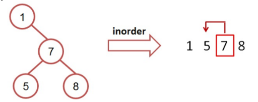

# 二元搜尋樹找 Predecessor

請撰寫一程式，創建一棵二元搜尋樹，並利用搜尋值找出搜尋值的 inorder/preoder/postoder predecessor (中序/前序/後序 前行節點)。

Predecessor 前行節點：

1. 對二元搜尋樹作樹的拜訪後，在搜尋值前的節點即為前行節點
2. 根據不同的拜訪，前行節點也不同
3. 以中序前行節點為例：

   1. 先對二元搜尋樹作中序拜訪
   2. 找出排在搜尋值的前一個節點數值，即為前行節點
   3. 以下圖為例，7 的中序前行節點為 5



## Input

輸入有兩列，

第一列為數個正整數值(介於 0 到 100 之間)，

代表欲創立的二元搜尋樹之元素，且數值間以空白隔開。

第二列為搜尋值。

## Output

輸出搜尋值的 inorder/preoder/postoder predecessor，

數值間分別以空白隔開。

## Sample

Input

```
1 7 5 8
7

```

Output

```
5 1 8

```
