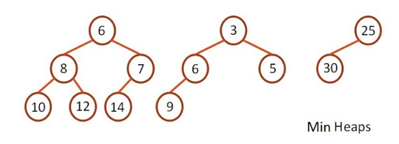
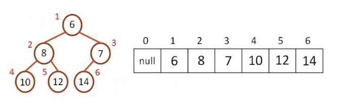
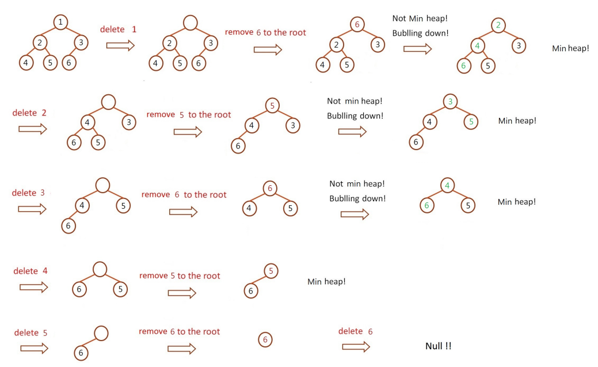

# Min Heap 刪除節點

建完整個 Min heap 後，刪除 Min heap 中的最小節點，每刪除一個節點就印出整棵樹，直到 Min heap 為空。

Min heap 性質

- 為一個完整二元樹
- 為一個最小樹，其所有父節點一定小於子節點
- 可以使用陣列實作 Min heap，陣列 index 0 不放節點





刪除節點

- 從 Min heap 中刪除一個元素，從 heap 的根節點開始刪除

- 步驟:
  1. 刪除根節點
  2. 將最後一個節點插入根節點
  3. 從根節點開始使用 bubbling down（冒泡）過程來保證目前的 heap 依然是 Min heap
  4. 從兩個子節點中，找出比較者，判斷是否小於目前節點，是則交換位置
  5. 重複第 4 步驟，直到所有父節點皆小於子節點



## Input

輸入一串數字 (每個數字用空白隔開)

## Output

建完 Min heap 後印出整棵樹，再做刪除，每刪除一個節點，就印出整棵樹，並以陣列的 `index` 代表完整二元樹中的每個位置。

## Sample

Input

```
1 2 3 4 5
```

Output

```
[1]1 [2]2 [3]3 [4]4 [5]5
[1]2 [2]4 [3]3 [4]5
[1]3 [2]4 [3]5
[1]4 [2]5
[1]5

```
