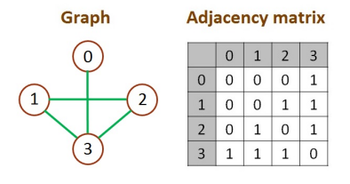

# 相鄰矩陣與相鄰串列

輸入一圖形資料(無向圖)，圖形可由邊集合來描述，每對頂點代表兩頂點之間有邊相連

將此圖形資料轉為 Adjacency matrices 及 Adjacency list 的格式。

- Adjacency matrices：圖形中點與點若有相連，在矩陣中相對應的值，會以 1 來表示兩點相連

  

- Adjacency list：圖形中，有與此頂點相連的頂點，會接在此頂點後方，以表示點與點有相連

  

## Input

輸入一串數字(數字用 tab 隔開，每對數字用換行區格)

## Output

輸出 Adjacency matrix ，且數字間有空白

輸出 Adjacency list ，數字與 -> 間及 -> 與 end 間有空白，且 index 與 ':' 之間有空白

## Sample

Input

```
0 3
1 2
1 3
2 3
```

Output

```
Adjacency matrix:
0 0 0 1
0 0 1 1
0 1 0 1
1 1 1 0

Adjacency list:
0: 3 -> end
1: 2 -> 3 -> end
2: 1 -> 3 -> end
3: 0 -> 1 -> 2 -> end

```
