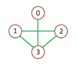
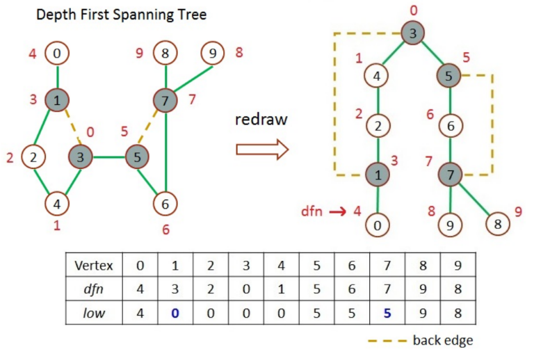

# 計算圖形的 low 與 dfn 值

輸入一圖形資料，圖形可由邊集合來描述，每對頂點代表兩頂點之間有邊相連，計算出圖中所有頂點的 low (u) 及 dfn 值。

圖形描述範例如下:

```
V(G1)={0,1,2,3}                    // 圖G1 中有4個頂點，分別為 0,1,2,3
E(G1)={(0,3),(1,2),(1,3),(2,3)}    // 每對數字代表兩個頂點之間有邊相連
```



- 深度優先序號 depth first numbers (dfn):
  - 定義：在頂點在深度優先搜尋時，頂點被拜訪的順序，若在深度優先樹中 u 是 v 的祖先,則 dfn(u)
- low(u):
  - 定義：利用 u 的後代以及至多一個 back edge（在 dfs 時不被經過的邊）可達到的頂點之最小深度優先序號。
  - 規則：low(u) = `min{ dfn(u), min{ low(w) | w is a child of u }, min{ dfn(w) | (u, w) is a back edge } }`
    1. `dfn(u)`：自己的 dfn 值
    2. `min{ low(w) | w is a child of u }`：子節點最小的 low 值
    3. `min{ dfn(w) | (u, w) is a back edge }`：利用 back edge 達到的最小 dfn 值 (祖先的 dfn 值)

**深度優先搜尋時，以節點 3 為開始節點，數字小的相鄰頂點先搜尋**



## Input

輸入一串數字(數字用空白隔開，每對數字用換行區格)


```
0 3
1 2
1 3
2 3
```

## Output

輸出圖中所有頂點的 dfn 及 low(u) 值

第一行輸出頂點 (最前方有使用 4 個空白)

第二行輸出各頂點之 dfn 值

第三行輸出各頂點之 low 值 (每個數字間用空白隔開)

## Sample

Input

```
0 1
1 2
1 3
2 4
3 4
3 5
5 6
5 7
6 7
7 8
7 9
```

Output

```
    0 1 2 3 4 5 6 7 8 9
dfn 2 1 3 0 4 5 6 7 8 9
low 2 0 0 0 0 5 5 5 8 9

```
