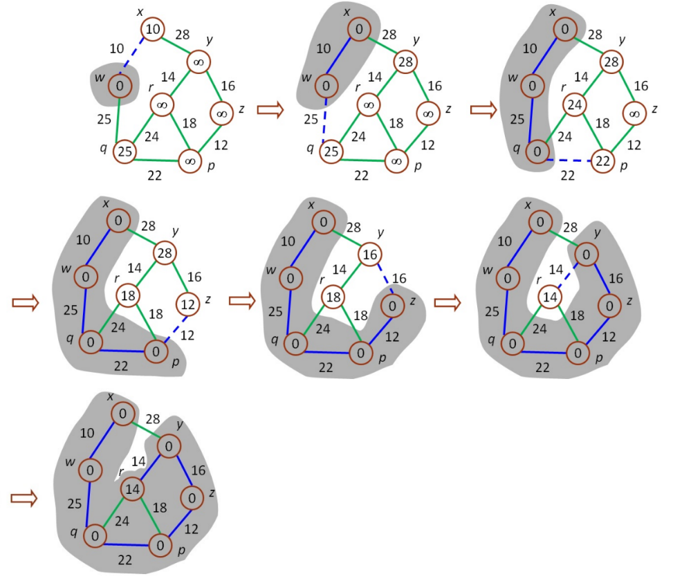

# Prim’s algorithm

輸入一圖形資料(無向圖)，圖形可由邊集合來描述，每對頂點代表兩頂點之間有邊相連，且每個邊都有其權重，使用 Adjacency list 儲存圖形資料，利用 Prim’s algorithm 找出 minimum spanning tree。

Prim’s algorithm：使用 greedy method 找出 minimum spanning tree，與 Kruskal’s Algorithm 類似，但邊集合結構為樹結構。

使用 greedy method 的限制：

- 所選擇的邊成本總和為最小成本
- 只能使用圖形內的邊
- 只能使用恰好 n-1 邊
- 不可使用會形成迴路的邊

作法：

- 選擇任一個頂點放入樹 T 中
- 以樹 T 往外尋找與 T 相連的最小邊，並記錄與 T 相連之每個頂點連至 T 之最小邊成本 (若未相連記為無限大 ∞ )
- 邊加入後，將紀錄頂點連至 T 之最小邊成本歸零
- 重覆加邊的步驟直到 T 有 n-1 個邊

範例：由頂點 w 開始



## Input

輸入一串數字(數字用 tab 隔開，每對數字用換行區格)，資料第一行數字為搜尋起點，前兩個數字代表與邊相連之兩個頂點，第三個數字代表此邊之權重。

## Output

輸出所找出 minimum spanning tree 的所有邊及其最小成本，且每對 間有空白。

## Sample

Input

```
0
0 1 28
0 5 10
1 2 16
1 6 14
2 3 12
3 4 22
3 6 18
4 5 25
4 6 24
```

Output

```
1: <0,5>
2: <5,4>
3: <4,3>
4: <3,2>
5: <2,1>
6: <1,6>

The cost of minimum spanning tree: 99

```
