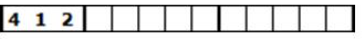
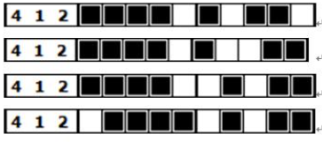

# 交集法

見下圖，最左邊是若干個提示數字與 10 個白色空格，提示數字的作用在於指出使用黑色填空的方式



數字代表相連的黑色方塊數量，例如，數字 4 1 2 代表此列有三條獨立的線段，分別占了 4 格、 1 格和 2 格，每條獨立的線段間要以至少 1 格的白色空格隔開

下圖是這個提示下的所有可能：



因此在空格數為 10 ，提示數字為 4 1 2 的情況下，會有 4 種可能性。對所有可能性作交集，我們可以知道哪些格子必然會被塗黑

以上圖為例，對這四種可能性作交集，判斷後的結果如下圖：


這個問題就是要給你盤面大小以及一組提示，請你利用交集法，判斷哪些格子一定會被塗黑

## Input

在本問題中， input 是空格數與若干個提示數字。因此 input 的第一個提示數字為空格的總數，其餘數字為提示數字

## Output

對於給定的空格數與提示數字，回答交集後的結果，`0`代表未塗黑，`1`代表塗黑

以輸入的例子而言，輸出為`0 1 1 1 0 0 0 0 1 0`

每個數字代表由左至右每一格的結果，中間以空格隔開

## Sample

1.  Input

    ```
    10 4 1 2
    ```

    Output

    ```
    0 1 1 1 0 0 0 0 1 0
    ```

2.  Input

    ```
    5 2 1
    ```

    Output

    ```
    0 1 0 0 0
    ```

3.  Input

    ```
    10 2 1 4
    ```

    Output

    ```
    0 1 0 0 0 0 1 1 1 0
    ```

## Hint

此題有多種解法

- bitset
- DFS
- 找規律(?
