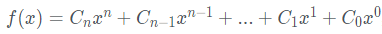
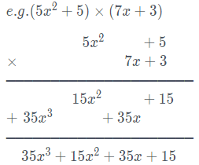

# 多項式乘法

一個多項式可用下列通式表示：

其中 `Cn` 表示 x 的 n 次項係數，`Cn` 為包含零的任意正負整數(或浮點數)，而 n 為包含零的任意正整數。

而多項式乘法為：

1. 被乘數需要和乘數的每一項相乘。
2. 相乘時，係數相乘，次數相加。



## Input

使用者輸入的格式如下 :

```
4         // 表示第一個多項式的非零項個數
3.5 5     // 表示第一個非零項的係數與項次：3.5x5
2 3       // 表示第二個非零項的係數與項次：2x3
9 2       // 表示第三個非零項的係數與項次：9x2
25 0      // 表示第四個非零項的係數與項次：25x0
5         // 表示第二個多項式的非零項個數
7 4
-2 3
5 2
-4 1
7 0
```

## Output

將通式列出 x 的 1 次項輸出 `x`，0 次項不顯示

第一行為 A 多項式

第二行為 B 多項式

第三行為 `A * B` 的多項式結果

> 小數點顯示到小數下 2 位數，最後一行有換行字元，只輸出非零項，正負號顯示需注意

## Sample

Input

```
4
3.5 5
2 3
9 2
25 0
5
7 4
-2 3
5 2
-4 1
7 0
```

Output

```
3.50x^5+2.00x^3+9.00x^2+25.00
7.00x^4-2.00x^3+5.00x^2-4.00x+7.00
24.50x^9-7.00x^8+31.50x^7+45.00x^6+16.50x^5+212.00x^4-72.00x^3+188.00x^2-100.00x+175.00
```
