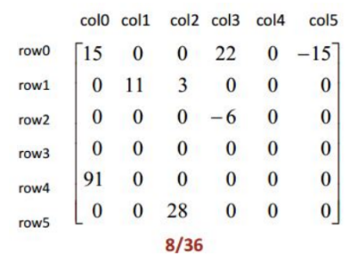
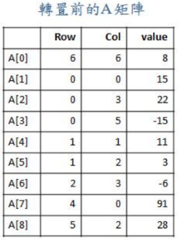
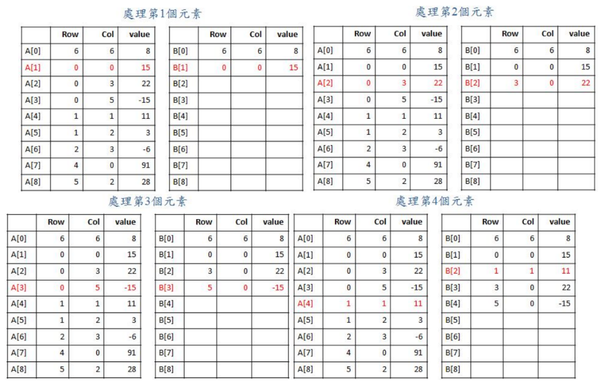
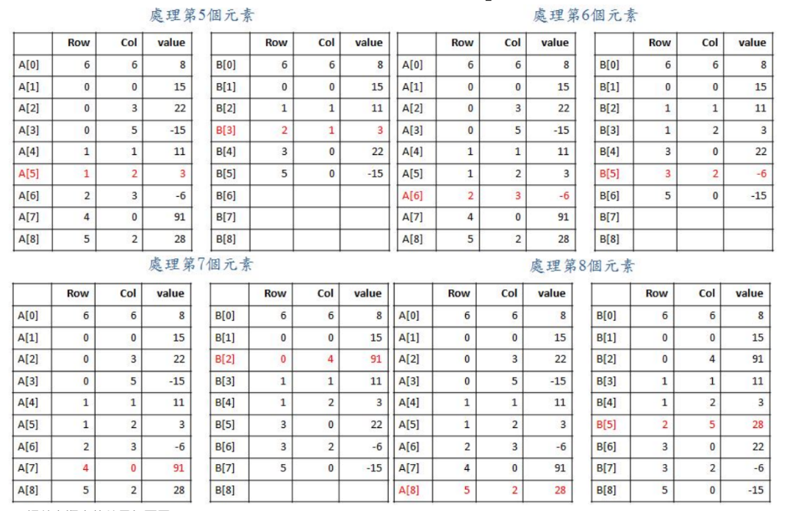
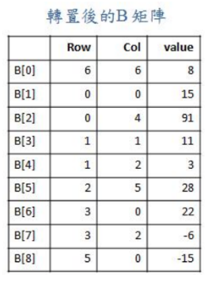

# 稀疏矩陣轉置法

稀疏矩陣是一種元素大部份為零的矩陣，下圖為一個 6x6 矩陣，其中非零元素有 8 個，其餘 28 個元素的值皆為零。矩陣的標準表示法為「二維陣列」，若將矩陣中所有的值都存進陣列裡，會花費大量空間，進行矩陣轉置時，也會花費許多額外的時間。因此，我們的策略是「只儲存非零元素」，這樣需要儲存的元素個數，將由 36 個降為 8 個，除了節省空間之外，也能減少矩陣轉置時所耗費的時間。



本次實習將介紹一種儲存稀疏矩陣的方法，以下為此方法的說明：

1. 先將稀疏矩陣中的非零值，依照列順序存入二維陣列中，如下圖，陣列中儲存的順序為「列、行、數值」，例如：`A[0]=<6,6,8>` 儲存整個矩陣的資訊，表示稀疏矩陣有 6 列、6 行、8 個非零值，接下來則是存放稀疏矩陣中各個非零值的資訊，`A[1]=<0,0,15>` 代表 A[1]存放第 0 列、第 0 行、值為 15 的元素，`A[2]=<0,3,22>`、`A[3]=<0,5,-15>`、`A[4]=<1,1,11>`，依此類推

   

2. 接下來依序由 A[1]到 A[8]，一次處理一個元素，將元素內的列與行交換，並像插入排序法一樣，將元素插入適當的位置，例如：`A[1]=<0,0,15>` 列與行交換後存入 `B[1]=<0,0,15>`、`A[2]=<0,3,22>`列與行交換後存入 `B[2]=<3,0,22>`、`A[3]=<0,5,-15>` 列與行交換後存入 `B[3]=<5,0,-15>`，由於 A[4]列與行交換後為<1,1,11>，必須插入 B[1]與 B[2]之間，因此我們必須將原來的 B[2]和 B[3]各往後移一格，再將 A[4]轉置後的元素插入 B[1]之後，形成 `B[1]=<0,0,15>`、`B[2]=<1,1,11>`、`B[3]=<3,0,22>`、`B[4]=<5,0,-15>`，依此類推

   
   

3. 調整完順序的結果如下圖，`B[1]=<0,0,15>`、`B[2]=<0,4,91>`、`B[3]=<1,1,11>`、`B[4]=<1,2,3>`、`B[5]=<2,5,28>`、`B[6]=<3,0,22>`、`B[7]=<3,2,-6>`、`B[8]=<5,0,-15>`

   

## Input

第一列為描述原始稀疏矩陣的資訊，第二列開始為原始稀疏矩陣的實際內容。(數字之間以一個空白隔開)

## Output

輸出為使用第一種演算法轉置之後的矩陣。(數字之間以一個空白隔開，最後一行也有換行)

## Sample

Input

```
6 6 8
0 0 15
0 3 22
0 5 -15
1 1 11
1 2 3
2 3 -6
4 0 91
5 2 28
```

Output

```
6 6 8
0 0 15
0 4 91
1 1 11
2 1 3
2 5 28
3 0 22
3 2 -6
5 0 -15
```
