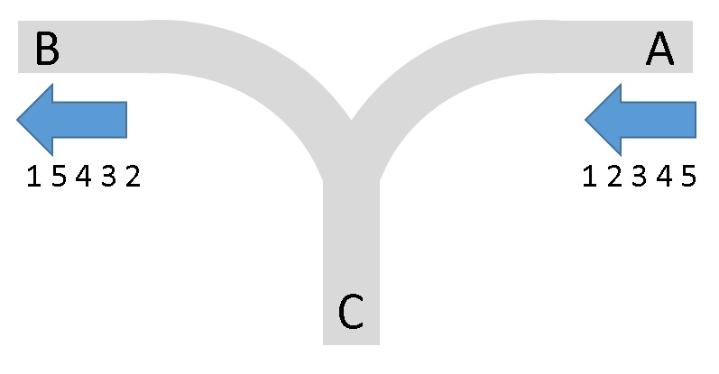

# 經典的鐵軌問題

某鐵路公司在建造火車站時，因當地居民的抗爭而無法取得足夠的土地建造足夠的鐵軌，因此他們建立了如下圖的一個特殊鐵軌站。火車固定由 A 方向進入，由 B 方向離開。而為了調度車廂，他們設了一個中介站 C 。車站軌道配置如下圖所示：



假設有 N 節車廂從 A 方向進入，按進站的次序，其編號分別為 `1 ~ N`, `N <= 1000` 。亦即，進入 A 站的車廂，其編號固定為 (1, 2, 3, ..., N)

你的任務是判斷能否讓這些車廂按照特定的編號次序離開 B 方向。例如（1, 2, 3, 4, 5）、（1, 5, 4, 3, 2）都是可行的離開次序；而（5, 4, 1, 2, 3）則不可行

車廂一旦進入 C，則不能再回到 A

## Input

輸入包含同一種車廂長度的多筆測資。輸入的第 1 行指明車廂長度；接著的每一行均包含一種欲判斷的次序，每個數字之間以空白隔開。最後 1 行為-1(結束)。例如：

```
5
1 2 3 4 5
2 1 3 4 5
5 4 1 2 3
-1
```

## Output

針對每一行欲判斷的次序，逐行輸出是否可行。若是則輸出 ”YES” ；若否則輸出 ”NO”. 以上例而言，其輸出應為：

```
YES
YES
NO
```

## Sample

Input

```
6
1 2 3 4 5 6
4 3 2 5 1 6
6 5 4 3 2 1
1 4 2 5 3 6
6 5 4 1 2 3
1 2 3 6 5 4
-1
```

Output

```
YES
YES
YES
NO
NO
YES
```
